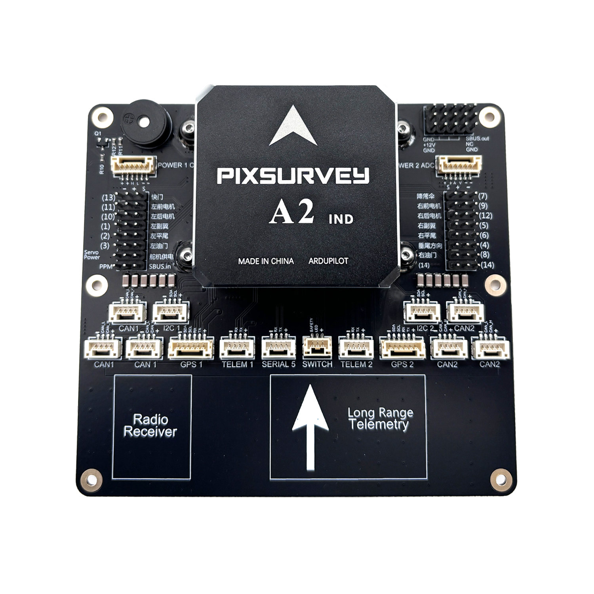

## PixSurveyA2-IND Flight Controller

The PixSurveyA2-IND flight controller is sold by a range of resellers listed on the makeflyeasy(http://www.makeflyeasy.com)

## Features

• STM32H743VIT6 microcontroller

•STM32F103C8T6 IOMCU microcontroller

•	Three IMUs, two IIM-42652(SPI), one ICM42688-P(SPI)

•	internal heater for IMUs temperature control

•	internal Soft Rubber Damping Ball isolation for All interna IMUs

•	Two barometers, BMP388(SPI)

•	builtin RAMTRON(SPI)

•	microSD card slot

•	5 UARTs

•	USB(Type-C)

•	PPM & S.Bus input

•	14 PWM outputs

•	two I2C ports and two FDCAN ports

•	one S.Bus output

•	internal Buzzer

• two voltage & current monitoring, one analog and one CAN

•	servo rail BEC independent power input for servos
 
•	external safety Switch

## Picture

## Pinout

UART Mapping
============

 - SERIAL0 -> console (primary mavlink, usually USB)
- SERIAL1 -> USART2 (Telem1,MAVLINK2) (DMA capable)
- SERIAL2 -> USART3 (Telem2, MAVLink2) (DMA capable)
 - SERIAL3 -> UART4 (GPS1) (TX is DMA capable)
  - SERIAL4 -> UART8 (GPS2) (RX is DMA capable)
 - SERIAL5 -> UART7   (USER)
 
 Connector pin assignments
=========================
POWER_CAN1 port
--------------------
<table border="1" class="docutils">
   <tbody>
   <tr>
   <th>PIN</th>
   <th>SIGNAL</th>
   <th>VOLT</th>
   </tr>
   <tr>
   <td>1</td>
   <td>VCC</td>
   <td>+5V</td>
   </tr>
   <tr>
   <td>2</td>
   <td>VCC</td>
   <td>+5V</td>
   </tr>
   <tr>
   <td>3</td>
   <td>CAN_H</td>
   <td>+12V</td>
   </tr>
   <tr>
   <td>4</td>
   <td>CAN_L</td>
   <td>+12V</td>
   </tr>
   <tr>
   <td>5</td>
   <td>GND</td>
   <td>GND</td>
   </tr>
   <tr>
   <td>6</td>
   <td>GND</td>
   <td>GND</td>
   </tr>
   </tbody>
   </table>

   
TELEM1, TELEM2 ports
--------------------

   <table border="1" class="docutils">
   <tbody>
   <tr>
   <th>Pin</th>
   <th>Signal</th>
   <th>Volt</th>
   </tr>
   <tr>
   <td>1</td>
   <td>VCC</td>
   <td>+5V</td>
   </tr>
   <tr>
   <td>2</td>
   <td>TX (OUT)</td>
   <td>+3.3V</td>
   </tr>
   <tr>
   <td>3</td>
   <td>RX (IN)</td>
   <td>+3.3V</td>
   </tr>
   <tr>
   <td>4</td>
   <td>GND</td>
   <td>GND</td>
   </tr>
   </tbody>
   </table>

I2C1, I2C2 ports
---------------

   <table border="1" class="docutils">
   <tbody>
   <tr>
   <th>PIN</th>
   <th>SIGNAL</th>
   <th>VOLT</th>
   </tr>
   <tr>
   <td>1</td>
   <td>VCC</td>
   <td>+5V</td>
   </tr>
   <tr>
   <td>2</td>
   <td>SCL</td>
   <td>+3.3V</td>
   </tr>
   <tr>
   <td>3</td>
   <td>SDA</td>
   <td>+3.3V</td>
   </tr>
   <tr>
   <td>4</td>
   <td>GND</td>
   <td>GND</td>
   </tr>
   </tbody>
   </table>

CAN1, CAN2 ports
---------------

   <table border="1" class="docutils">
   <tbody>
   <tr>
   <th>PIN</th>
   <th>SIGNAL</th>
   <th>VOLT</th>
   </tr>
   <tr>
   <td>1</td>
   <td>VCC</td>
   <td>+5V</td>
   </tr>
   <tr>
   <td>2</td>
   <td>CAN_H</td>
   <td>+12V</td>
   </tr>
   <tr>
   <td>3</td>
   <td>CAN_L</td>
   <td>+12V</td>
   </tr>
   <tr>
   <td>4</td>
   <td>GND</td>
   <td>GND</td>
   </tr>
   </tbody>
   </table>

Safety and buzzer port
-----------

   <table border="1" class="docutils">
   <tbody>
   <tr>
   <th>PIN</th>
   <th>SIGNAL</th>
   <th>VOLT</th>
   </tr>
   <tr>
   <td>1</td>
   <td>VCC</td>
   <td>+5V</td>
   </tr>
   <tr>
   <td>2</td>
   <td>LED</td>
   <td>+5V</td>
   </tr>
   <tr>
   <td>3</td>
   <td>Safety Switch</td>
   <td>+5V</td>
   </tr>
   </tbody>
   </table>
   

GPS1/I2C1, GPS2/I2C2 ports
--------------------------

   <table border="1" class="docutils">
   <tbody>
   <tr>
   <th>PIN</th>
   <th>SIGNAL</th>
   <th>VOLT</th>
   </tr>
   <tr>
   <td>1</td>
   <td>VCC</td>
   <td>+5V</td>
   </tr>
   <tr>
   <td>2</td>
   <td>TX</td>
   <td>+3.3V</td>
   </tr>
   <tr>
   <td>3</td>
   <td>RX</td>
   <td>+3.3V</td>
   </tr>
   <tr>
   <td>4</td>
   <td>SCL</td>
   <td>+3.3V</td>
   </tr>
   <tr>
   <td>5</td>
   <td>SDA</td>
   <td>+3.3V</td>
   </tr>
   <tr>
   <td>6</td>
   <td>GND</td>
   <td>GND</td>
   </tr>
   </tbody>
   </table>

Serial5 port
--------------------

   <table border="1" class="docutils">
   <tbody>
   <tr>
   <th>Pin</th>
   <th>Signal</th>
   <th>Volt</th>
   </tr>
   <tr>
   <td>1</td>
   <td>VCC</td>
   <td>+5V</td>
   </tr>
   <tr>
   <td>2</td>
   <td>TX (OUT)</td>
   <td>+3.3V</td>
   </tr>
   <tr>
   <td>3</td>
   <td>RX (IN)</td>
   <td>+3.3V</td>
   </tr>
   <tr>
   <td>4</td>
   <td>GND</td>
   <td>GND</td>
   </tr>
   </tbody>
   </table>
   
 Power2 ADC ports
--------------------

   <table border="1" class="docutils">
   <tbody>
   <tr>
   <th>PIN</th>
   <th>SIGNAL</th>
   <th>VOLT</th>
   </tr>
   <tr>
   <td>1</td>
   <td>VCC</td>
   <td>+5V</td>
   </tr>
   <tr>
   <td>2</td>
   <td>VCC</td>
   <td>+5V</td>
   </tr>
   <tr>
   <td>3</td>
   <td>CURRENT</td>
   <td>+3.3V</td>
   </tr>
   <tr>
   <td>4</td>
   <td>VOLTAGE</td>
   <td>+3.3V</td>
   </tr>
   <tr>
   <td>5</td>
   <td>GND</td>
   <td>GND</td>
   </tr>
   <tr>
   <td>6</td>
   <td>GND</td>
   <td>GND</td>
   </tr>
   </tbody>
   </table>

RC Input
--------

All compatible RC protocols can be decoded by attaching the Receiver's output to the SBUS input pin next to the Servo/Output VCC input connector. Note that some protocols such as CRSF or FPort including telemetry, require connection to, and setup of, one of the UARTs instead of this pin.

Battery Monitor Settings
========================

These should already be set by default. However, if lost or changed:

Enable Battery monitor with these parameter settings :
 - `BATT2_MONITOR<BATT_MONITOR>` 4

Then reboot.

- `BATT2_VOLT_PIN<BATT2_VOLT_PIN>` 13

- `BATT2_CURR_PIN<BATT2_CURR_PIN>` 4

- `BATT2_VOLT_MULT<BATT2_VOLT_MULT>` 18.0

- `BATT2_AMP_PERVLT<BATT2_AMP_PERVLT>` 24.0

DroneCAN capability
===================
There are 6 CAN ports which allow connecting two independant CAN bus outputs. Each of these can have multiple CAN peripheral devices connected. There are also two separate CAN POWER ports for easy access to CAN-PMU.

Where to Buy
============

`makeflyeasy <http://www.makeflyeasy.com>`_

